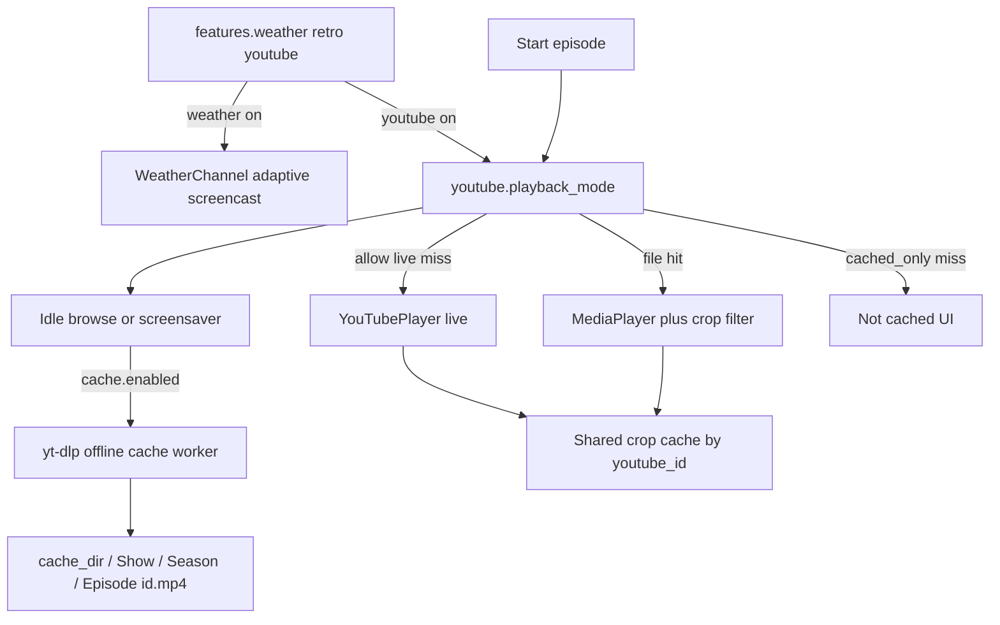

# Pi feature gates, adaptive Weather, and offline YouTube

**Status:** Planned (not yet implemented)  
**Date:** 2026-08-06  
**Related:** [Improvement plan](improvement-plan.md), [Configuration](../usage/configuration.md), [Raspberry Pi setup](../usage/raspberry-pi.md)

Living project plan for making Weather usable on every Raspberry Pi, gating heavy Chrome features behind config, and adding a forever yt-dlp YouTube cache so weak devices can play the same collections with identical crop/zoom behavior.

Each phase ends with a **retro** whose outputs adjust the next phase. Each phase has an explicit **test plan** (automated + manual / hardware).

---

## Problem statement

| Pain | Today | Desired |
|------|--------|---------|
| Weather / Retro / YouTube Chrome CDP is heavy | Full-res screencast at high FPS; UI always offers dials | Weather on all Pis via adaptive FPS; optional disable of Retro/YouTube |
| YouTube live Chrome is unrealistic on Pi 1 / Zero | Shows appear; playback fails or stutters | Forever file cache + `cached_only` policy |
| Offline files would skip crop | Crop/zoom only in `YouTubePlayer` | Live and file backends share crop cache + UX |
| Config hard to tune per device | Sparse comments | Feature flags + heavily annotated `config.example.json` + Pi profiles |

---

## Goals (acceptance at program level)

1. **Weather on all Pi models** via dynamic screencast framerate/quality (even 1–2 FPS is acceptable).
2. **Feature flags** so disabled Weather / Retro / YouTube never appear in dial/UI and never spawn Chrome for that feature.
3. **YouTube dual backends** with identical crop/zoom:
   - **Live** — existing Chrome CDP path.
   - **Cached file** — yt-dlp forever cache → ffmpeg/omx.
4. **Device policy:** weak devices require cache (`cached_only` + not-cached indicator); strong devices optionally cache and may still watch live (`prefer_cache`).
5. **Documentation:** usage docs, Pi profiles, and `_about` comments in example config explaining *why* defaults differ by hardware.

**Non-goals (this program):** rewriting Retro TV (beyond feature gate); parental controls; replacing catalog scrape with the YouTube Data API; LRU eviction of the forever YouTube cache (unless a later retro demands it).

---

## Architecture overview



### Config sketch (target)

```json
"features": {
  "_about": "Master switches. false removes dial/UI entry and never starts Chrome for that feature.",
  "weather": true,
  "retro_tv": true,
  "youtube": true
},
"weather": {
  "screencast": {
    "_about": "auto = adapt FPS/quality/resolution from measured latency. Oldest Pis may land at 1–2 FPS.",
    "mode": "auto",
    "min_fps": 1,
    "max_fps": 15
  },
  "zip": "02108",
  "name": "Boston"
},
"youtube": {
  "_about": "Backends: live Chrome vs forever file cache. Crop/zoom must match. Requires features.youtube.",
  "playback_mode": "prefer_cache",
  "cache": {
    "_about": "Forever cache (local or NAS). High-end: enable while allowing live. Low-end: cached_only.",
    "enabled": false,
    "directory": null,
    "max_bytes": null,
    "download_when_idle": true,
    "idle_seconds": 30,
    "format": "bv*[height<=720]+ba/b[height<=720]/b"
  }
}
```

`youtube_channels` remains the channel list (unchanged schema).

### Playback policy matrix

| `playback_mode` | Cache hit | Cache miss | Typical device |
|-----------------|-----------|------------|----------------|
| `live` | Chrome (ignore file) | Chrome | Debug / force live |
| `prefer_cache` | File | Chrome live | Pi 4/5 optional cache |
| `cached_only` | File | Block + not-cached UI | Pi 1 / Zero / weak ARM |

If a file exists and mode is not `live`, **always play the file**.

---

## Phase map

| Phase | Theme | Primary outcomes | Depends on |
|-------|--------|------------------|------------|
| [0](#phase-0-baseline--planning-complete) | Baseline | This doc; inventory of touch points | — |
| [1](#phase-1-feature-flags) | Feature flags | `features.*`; dial/UI/Chrome gated | 0 |
| [2](#phase-2-adaptive-weather) | Adaptive Weather | Screencast auto FPS/quality; tick/blit caps | 1 (gate) |
| [3](#phase-3-shared-crop-foundation) | Shared crop | Normalized crop cache; extract detectors | — (can parallel 1–2) |
| [4](#phase-4-offline-youtube-cache) | Forever cache | yt-dlp layout, idle worker, CLI sync | 1 |
| [5](#phase-5-playback-routing--not-cached-ui) | Routing + UI | Modes, file vs live start, not-cached marker | 4 |
| [6](#phase-6-cropzoom-parity-on-file-backend) | Crop parity | File probe/apply + zoom toggle = live | 3, 5 |
| [7](#phase-7-docs-profiles--hardening) | Docs & profiles | Example config, Pi profiles, end-to-end verify | 1–6 |

Phases 1–2 and 3 can overlap. Phase 6 must not ship file playback as “done” without crop parity.

---

## Phase 0: Baseline & planning complete

**Goal:** Shared understanding, documented touch points, no code yet beyond this plan.

### Tasks

| ID | Task | Owner hint | Done when |
|----|------|------------|-----------|
| 0.1 | Publish this plan under `docs/development/` | docs | Linked from developer README |
| 0.2 | Inventory files: `config.py`, `dial_nav.py`, `app.py`, `weather_channel.py`, `youtube_player.py`, `youtube_crop_cache.py`, `player.py`, `playback_cache.py` (do **not** overload) | eng | Listed in this doc |
| 0.3 | Agree Pi profile defaults (table below) | eng + operator | Written in Phase 7 draft |

### Recommended device profiles (draft)

| Hardware | `features.weather` | `features.retro_tv` | `features.youtube` | `weather.screencast` | `youtube.playback_mode` | `youtube.cache.enabled` |
|----------|--------------------|---------------------|--------------------|----------------------|-------------------------|-------------------------|
| Pi 1 / Zero | on | **off** | on | `auto` | `cached_only` | on (NAS preferred) |
| Pi 2 / 3 | on | optional | on | `auto` | `prefer_cache` | optional |
| Pi 4 / 5 / desktop | on | on | on | `auto` or fixed | `prefer_cache` or `live` | optional |

### Phase 0 retro

| Question | Feeds |
|----------|--------|
| Any profile wrong for a known device in the fleet? | Phase 7 defaults |
| Is NAS vs local SSD the primary cache target? | Phase 4 path docs |

**Outputs:** [ ] Profiles confirmed · [ ] Cache target decision recorded

### Test plan (Phase 0)

- Doc review only: links resolve; architecture matches operator intent.
- No automated tests.

---

## Phase 1: Feature flags

**Goal:** Operators can disable Weather, Retro TV, and YouTube so the UI never offers them and Chrome is never started for those features.

### Deliverables

1. Parse `features.weather` / `features.retro_tv` / `features.youtube` in [`config.py`](../../src/tv_time_capsule/config.py) (default `true`).
2. [`dial_nav.py`](../../src/tv_time_capsule/dial_nav.py): disabled features → no `WEATHER` / `RETRO_TV` dial kinds (or app ignores them).
3. [`app.py`](../../src/tv_time_capsule/app.py): skip enter Weather/Retro; skip YouTube merge + catalog refresh when YouTube off.
4. Hide Help / easter-egg / footer mentions when disabled.
5. Stub docs + `_about` on `features` in `config.example.json`.

### Success criteria

- With `features.youtube: false`, no YouTube shows in the list and no catalog Chrome scrape.
- With `features.weather: false`, dial `004` does nothing useful (no Weather view).
- With `features.retro_tv: false`, decade dials do not open Retro.
- Defaults unchanged for existing installs (all features on).

### Tasks

| ID | Task | Files (expected) |
|----|------|------------------|
| 1.1 | `_parse_features` + defaults | `config.py` |
| 1.2 | Dial / app gates | `dial_nav.py`, `app.py` |
| 1.3 | UI string gates | `app.py` (help / fun copy) |
| 1.4 | Example config + config.md stub | `config.example.json`, `docs/usage/configuration.md` |
| 1.5 | Unit tests | `tests/test_config.py`, `tests/test_dial_nav.py` (or new) |

### Phase 1 retro → informs Phase 2

| Question | Why |
|----------|-----|
| Did operators want per-feature Chrome “available but hidden”? | No — keep hard off |
| Any accidental coupling (YouTube off still launching Chrome for Weather)? | Fix before adaptive Weather stress |

**Outputs:** [ ] Default-on confirmed · [ ] List of remaining Chrome entry points when YouTube off

### Test plan (Phase 1)

**Automated**

| Case | Steps / assert |
|------|----------------|
| Defaults | Fresh config → all three features `true` |
| Parse false | `features.youtube: false` → parsed false |
| Dial weather off | `classify_dial("004")` ignored or app no-ops when weather false |
| Dial retro off | Decade dial no-ops when retro false |
| YouTube off merge | App/library helper does not inject YouTube shows when flag false |

**Manual**

| Case | Hardware | Steps | Pass |
|------|----------|-------|------|
| YouTube hidden | Any | Set `features.youtube: false`, restart, browse shows | No YT shows; no scrape in logs |
| Weather dial dead | Pi with Chrome | `features.weather: false`, dial `004` | Stays on browse; no Weather Chrome |
| Retro dial dead | Pi with Chrome | `features.retro_tv: false`, dial `1990` | No Retro |
| Backward compat | Existing config without `features` | Start app | Weather/Retro/YT still work |

---

## Phase 2: Adaptive Weather

**Goal:** Weather remains usable on the oldest Pis by lowering screencast cost dynamically.

### Deliverables

1. `weather.screencast` config: `mode` (`auto` | fixed knobs), `min_fps`, `max_fps`, optional `target_fps` / `max_width` / `max_height` / `jpeg_quality`.
2. [`weather_channel.py`](../../src/tv_time_capsule/weather_channel.py): start conservative on ARM; adapt `everyNthFrame` / quality / resolution from measured latency; restart screencast on step changes if needed.
3. Cap pygame tick in Weather view to effective FPS.
4. Prefer `pygame.transform.scale` over `smoothscale` on weak ARM / when frame≈canvas.
5. Log effective FPS/quality for field diagnosis.

### Success criteria

- Pi 4: Weather feels continuous (roughly ≥8–10 FPS under auto, network permitting).
- Pi 1 / Zero: Weather still paints updates (even 1–2 FPS); UI remains responsive to volume/back; no multi-minute Chrome lockup.
- Manual fixed `target_fps: 2` honored for testing.

### Tasks

| ID | Task |
|----|------|
| 2.1 | Config parse for `weather.screencast` |
| 2.2 | Adaptive controller (pure logic, unit-testable) |
| 2.3 | Wire into `Page.startScreencast` + restart |
| 2.4 | App tick + blit path |
| 2.5 | Docs: screencast knobs + Pi notes |

### Phase 2 retro → informs Phases 4–5

| Question | Why |
|----------|-----|
| Is Weather alone enough Chrome for Pi 1, or still too heavy? | May recommend Weather off on extreme devices |
| Did auto settle too aggressively (unusable)? | Tune min_fps / start profile |
| Should Retro reuse the same controller next? | Backlog item; not blocking YouTube cache |

**Outputs:** [ ] Measured FPS table per device · [ ] Default min/max FPS locked · [ ] Retro-share decision (yes/defer)

### Test plan (Phase 2)

**Automated**

| Case | Assert |
|------|--------|
| Controller step-down | High latency → higher `everyNthFrame` / lower quality |
| Controller floor | Never below `min_fps` |
| Controller ceiling | Never above `max_fps` |
| Config parse | Invalid values clamp or fall back to defaults |

**Manual**

| Case | Hardware | Steps | Pass |
|------|----------|-------|------|
| Auto on Pi 4 | Pi 4 | Dial `004`, watch 2 min | Readable motion; back exits cleanly |
| Auto on oldest Pi | Pi 1 / Zero | Dial `004` | Frames arrive; no freeze requiring reboot; volume works |
| Fixed low FPS | Any | `target_fps: 1`, restart | ~1 FPS; CPU lower than default (top/htop) |
| Feature off still | Any | `features.weather: false` | No regression from Phase 1 |

---

## Phase 3: Shared crop foundation

**Goal:** Crop detection and cache are backend-agnostic so live and file playback can share decisions.

### Deliverables

1. Extract detectors from [`youtube_player.py`](../../src/tv_time_capsule/youtube_player.py) into e.g. `youtube_crop.py`.
2. Bump [`youtube_crop_cache.py`](../../src/tv_time_capsule/youtube_crop_cache.py) `CROP_CACHE_VERSION`: store **normalized** rect fractions + `apply`.
3. Live path reads/writes normalized form (convert to/from viewport pixels at apply time).
4. Migration: old absolute caches miss safely and re-probe (acceptable).

### Success criteria

- Live YouTube crop behavior unchanged for operators (same zoom toggle, same episodes).
- Unit tests cover normalize ↔ pixel round-trip and version bump miss.

### Tasks

| ID | Task |
|----|------|
| 3.1 | Extract pure detection helpers + tests (fixture frames) |
| 3.2 | Normalized cache schema + load/save |
| 3.3 | Refactor `YouTubePlayer` to use shared module |
| 3.4 | Regression: known videos (pillarbox, windowboxed 16:9, full-bleed) |

### Phase 3 retro → informs Phase 6

| Question | Why |
|----------|-----|
| Did version bump cause mass re-probes / slow starts? | Consider one-shot migration or longer TTL messaging |
| Any detector drift after extract? | Fix before file backend |

**Outputs:** [ ] Fixture list of youtube_ids for parity · [ ] Confirm cover vs fit rules still correct |

### Test plan (Phase 3)

**Automated**

| Case | Assert |
|------|--------|
| Detect pillarbox fixture | Returns expected normalized crop within tolerance |
| Detect full-bleed | `crop is None` or apply false as today |
| Cache round-trip | Save fractions → load → applied pixels at WxH match |
| Version mismatch | Old v4 entry treated as miss |
| Live player smoke | Existing youtube crop unit tests still pass |

**Manual**

| Case | Steps | Pass |
|------|-------|------|
| Known pillarbox ep | Play live, note zoom; restart app; replay | Crop cache hit; picture matches prior session |
| Toggle T | Zoom off/on | Persists in cache; snackbar consistent |
| Windowboxed 16:9 | Known id (e.g. prior `oWVu75cqQpU` case) | Still fits correctly after refactor |

---

## Phase 4: Forever YouTube offline cache

**Goal:** Idle yt-dlp downloads configured channels into a persistent tree with sanitized episode names.

### Deliverables

1. New module e.g. `youtube_offline_cache.py` (do **not** overload [`playback_cache.py`](../../src/tv_time_capsule/playback_cache.py)).
2. Config `youtube.cache.*` + Poetry/`yt-dlp` dependency (or clear optional-import error).
3. Layout: `{cache_dir}/{Show}/Season {NN}/{Title} [{youtube_id}].mp4` + `.manifest.json`.
4. Idle worker: browse/screensaver only; pause on playback / Weather / Retro / live YT.
5. CLI: `tv-time-capsule --youtube-cache-sync` for headless/NAS fill.

### Success criteria

- With cache enabled and idle, missing episodes download one-at-a-time without interrupting browse.
- Filenames match sanitized catalog titles; id suffix present.
- Stopping playback / leaving idle cancels or pauses download promptly.
- `max_bytes: null` never deletes completed files.

### Tasks

| ID | Task |
|----|------|
| 4.1 | Config parse `youtube` block (cache subsection) |
| 4.2 | Manifest + path builders + filename sanitize |
| 4.3 | yt-dlp download wrapper |
| 4.4 | Idle scheduler in app |
| 4.5 | CLI sync command |
| 4.6 | Install/docs note for `yt-dlp` |

### Phase 4 retro → informs Phase 5

| Question | Why |
|----------|-----|
| Download bandwidth / disk surprises? | Rate limit defaults; docs warnings |
| NAS locking / partial files? | Atomic rename policy confirmation |
| Should catalog scrape stay Chrome-only on weak Pis? | Document “fill cache elsewhere” workflow |

**Outputs:** [ ] Atomic write policy locked · [ ] Default format string confirmed (720p) · [ ] Partial-file handling |

### Test plan (Phase 4)

**Automated**

| Case | Assert |
|------|--------|
| Path builder | Show/season/title/id → safe relative path |
| Sanitize | `/` and `:` stripped; unicode handled |
| Manifest upsert | Id maps to relpath; reload durable |
| Idle gate helper | Not idle when PLAYING / WEATHER / RETRO |
| Missing yt-dlp | Clear error when cache.enabled and import fails |

**Manual**

| Case | Steps | Pass |
|------|-------|------|
| Idle download | Enable cache, small channel, wait idle | File appears; manifest updated; UI responsive |
| Interrupt | Start download, then play local show | Download pauses; no corrupt final file (`.part` cleaned or ignored) |
| CLI sync | `--youtube-cache-sync` on desktop → NAS | Files usable from Pi mount |
| Forever | Revisit after days | Files still present; no eviction |

---

## Phase 5: Playback routing & not-cached UI

**Goal:** Route YouTube starts by mode; show clear not-cached state on weak devices.

### Deliverables

1. `youtube.playback_mode`: `live` | `prefer_cache` | `cached_only`.
2. `_can_start_episode` / `_start_current_episode`: file hit → file backend; miss + `cached_only` → block; else live.
3. Progress / resume keys remain `youtube:{id}`.
4. Episode list **not cached** marker when relevant; snackbar on play attempt.
5. Autocomplete/autoplay skips uncached when `cached_only`.

### Success criteria

- `prefer_cache` + file present → no Chrome for that episode (logs confirm MediaPlayer).
- `prefer_cache` + miss → live Chrome (capable device).
- `cached_only` + miss → visible not-cached; no Chrome spawn for playback.
- `live` + file present → still Chrome (debug path).

### Tasks

| ID | Task |
|----|------|
| 5.1 | Resolve offline path helper |
| 5.2 | Wire start/can_start |
| 5.3 | Episode row indicator + snackbar |
| 5.4 | Autoplay skip behavior |
| 5.5 | Tests for routing matrix |

### Phase 5 retro → informs Phase 6

| Question | Why |
|----------|-----|
| Is “not cached” discoverable enough for kids UI? | Copy / icon tweak |
| Any wrong backend chosen (Chrome when file exists)? | Fix before crop parity polish |

**Outputs:** [ ] Snackbar copy final · [ ] Whether browse shows marker in `prefer_cache` too (decision: yes when `cache.enabled`) |

### Test plan (Phase 5)

**Automated**

| Case | Assert |
|------|--------|
| prefer_cache hit | Router selects `file` |
| prefer_cache miss | Router selects `live` |
| cached_only miss | Router selects `blocked`; can_start false |
| live + hit | Router selects `live` |
| Progress key | File play still uses `youtube:{id}` |

**Manual**

| Case | Hardware | Steps | Pass |
|------|----------|-------|------|
| File path | Pi 4 | Cache one ep, `prefer_cache`, play | ffmpeg/omx; no Chrome for play |
| Fallback live | Pi 4 | Uncached ep, `prefer_cache` | Live works |
| Cached only miss | Pi 1 | Uncached ep | Marker + snackbar; no Chrome |
| Cached only hit | Pi 1 | Pre-filled NAS file | Plays |
| Autoplay skip | Any | Season with mix cached/uncached, `cached_only` | Skips uncached without hanging |

---

## Phase 6: Crop / zoom parity on file backend

**Goal:** Offline YouTube looks and toggles like live YouTube.

### Deliverables

1. Offline probe: sample early frames via ffmpeg → shared detector → crop cache.
2. Apply normalized crop in `build_ffmpeg_decode_cmd` / MediaPlayer (`crop=` then scale/pad or cover).
3. `_toggle_youtube_zoom` works for file backend (persist `apply`).
4. Reuse live-written cache entries without re-probe when present.
5. Same user-facing snackbars / help text for zoom.

### Success criteria

- Side-by-side (or sequential) live vs file for the same `youtube_id`: framing matches within a small tolerance; zoom off shows full upload including bars; zoom on crops content.
- No shipping of “file plays letterboxed full frame while live zooms” as acceptable.

### Tasks

| ID | Task |
|----|------|
| 6.1 | File frame sampler for probe |
| 6.2 | ffmpeg vf crop from normalized rect |
| 6.3 | Zoom toggle for file player path |
| 6.4 | Cover vs fit parity with live rules |
| 6.5 | Parity fixtures + manual checklist |

### Phase 6 retro → informs Phase 7

| Question | Why |
|----------|-----|
| Probe too slow on Pi 1 first play? | Pre-probe at download time on strong machine |
| omx vs ffmpeg crop gaps? | Prefer ffmpeg path when crop required |

**Outputs:** [ ] Pre-probe-at-download decision · [ ] Hardware decode + crop compatibility note |

### Test plan (Phase 6)

**Automated**

| Case | Assert |
|------|--------|
| Apply crop vf | Normalized rect → expected `crop=w:h:x:y` string for given size |
| Zoom apply false | No content crop in vf; scale+pad only |
| Cache reuse | File start with existing entry skips probe (mock) |

**Manual (parity checklist)**

| youtube_id / type | Live zoom on | File zoom on | Live zoom off | File zoom off | Pass |
|-------------------|--------------|--------------|---------------|---------------|------|
| Classic 4:3 pillarbox | | | | | |
| Windowboxed 16:9 in 4:3 | | | | | |
| Full-bleed 16:9 | | | | | |
| Ad-prone title (ensure post-roll N/A for file) | | | | | |

Also: toggle **T** mid-playback on file; restart; preference persisted.

---

## Phase 7: Docs, profiles, and hardening

**Goal:** Operators can configure a fleet without reading source; program-level acceptance met.

### Deliverables

1. Expand [`config.example.json`](../../config.example.json) `_about` comments for all new keys.
2. Update [`configuration.md`](../usage/configuration.md), [`raspberry-pi.md`](../usage/raspberry-pi.md), [`media-library.md`](../usage/media-library.md), fun-tweaks dial tables.
3. Short workflow: “Fill cache on desktop/NAS → play `cached_only` on old Pi”.
4. End-to-end matrix run on at least one weak and one strong device.
5. Mark this plan status **Implemented** (or partially, with leftover backlog).

### Success criteria

- New operator can pick a Pi profile from docs and get a working config.
- Program goals checklist (top of doc) all checked.
- CI green for new unit tests.

### Tasks

| ID | Task |
|----|------|
| 7.1 | Docs pass |
| 7.2 | Example config pass |
| 7.3 | E2E matrix (below) |
| 7.4 | Retro of the whole program; backlog leftovers |

### Program retro

| Question | Follow-up |
|----------|-----------|
| Weather-only Chrome still too much on Pi 1? | Profile Weather off |
| Cache disk growth acceptable? | Optional max_bytes later |
| Should Retro get adaptive screencast? | New phase in improvement plan |
| Crop pre-probe at download? | Small follow-up PR |

**Outputs:** [ ] Backlog tickets filed · [ ] Plan status updated · [ ] Link from improvement-plan.md if desired |

### Test plan (Phase 7) — end-to-end matrix

| # | Profile | Device | Weather | Retro | YT mode | Cache | Verify |
|---|---------|--------|---------|-------|---------|-------|--------|
| A | Pi 1 offline YT | Pi 1 / Zero | auto | off | `cached_only` | NAS filled | Weather updates; YT file play + crop; uncached blocked |
| B | Pi 4 hybrid | Pi 4 | auto | on | `prefer_cache` | local optional | Live miss works; hit uses file; crop match |
| C | Flags off | Any | off | off | features.youtube false | — | No dials/shows; local media only |
| D | Force live | Desktop | on | on | `live` | on | Plays Chrome even if file exists |
| E | CLI fill | Desktop → Pi | — | — | — | sync CLI | Pi sees files without downloading itself |

**CI gate before calling the program done:** all Phase 1–6 automated tests green on PR.

---

## Cross-cutting test strategy

| Layer | What | When |
|-------|------|------|
| Unit | Config parse, dial gates, adaptive controller, path/manifest, crop normalize, router matrix | Every PR |
| Integration | Optional: mock yt-dlp download into temp dir + manifest | Phase 4+ |
| Manual / hardware | Weather FPS, Chrome absence, live vs file crop parity, NAS | End of phases 2, 5, 6, 7 |
| Regression | Existing YouTube ad/crop/title tests must stay green | Phases 3, 6 |

Do not require live YouTube network in CI for crop detector tests — use RGB fixtures.

---

## Risk register

| Risk | Impact | Mitigation |
|------|--------|------------|
| yt-dlp breaks / ToS / format churn | Downloads fail | Pin yt-dlp; document update; CLI re-sync |
| Crop coords differ live vs file (player chrome vs raw video) | Parity fails | Probe offline from **decoded video** frames, not Chrome UI; compare fixtures |
| Idle downloads saturate Pi / network | UI jank | One-at-a-time; rate_limit; pause on any input |
| Partial files played as complete | Glitches | Write to `.part`, rename on success; manifest only after rename |
| omxplayer cannot apply crop filters | Weak-Pi crop broken | Prefer ffmpeg RGB path when YouTube crop apply is set |
| Disk fill on forever cache | Device full | Docs; optional `max_bytes` later; NAS |

---

## Implementation order (summary)

1. Phase 1 — feature flags  
2. Phase 2 — adaptive Weather  
3. Phase 3 — shared crop foundation (parallel OK with 1–2)  
4. Phase 4 — forever cache + idle + CLI  
5. Phase 5 — routing + not-cached UI  
6. Phase 6 — file crop/zoom parity (required before “YouTube offline done”)  
7. Phase 7 — docs, profiles, E2E matrix, program retro  

---

## Progress checklist

- [ ] Phase 0 — plan published  
- [ ] Phase 1 — feature flags  
- [ ] Phase 2 — adaptive Weather  
- [ ] Phase 3 — shared crop foundation  
- [ ] Phase 4 — offline cache  
- [ ] Phase 5 — routing + not-cached UI  
- [ ] Phase 6 — crop/zoom parity  
- [ ] Phase 7 — docs + E2E + program retro  

---

## Key file touch map (expected)

| Area | Files |
|------|--------|
| Config | `src/tv_time_capsule/config.py`, `config.example.json` |
| Flags / dials | `dial_nav.py`, `app.py` |
| Weather | `weather_channel.py`, `app.py` (draw/tick) |
| Crop | `youtube_crop.py` (new), `youtube_crop_cache.py`, `youtube_player.py` |
| Offline cache | `youtube_offline_cache.py` (new), `cli.py`, `app.py` |
| File play + crop | `player.py`, `app.py` |
| Docs | `docs/usage/configuration.md`, `raspberry-pi.md`, `media-library.md`, fun-tweaks, this file |
| Tests | `tests/test_*.py` as listed per phase |
